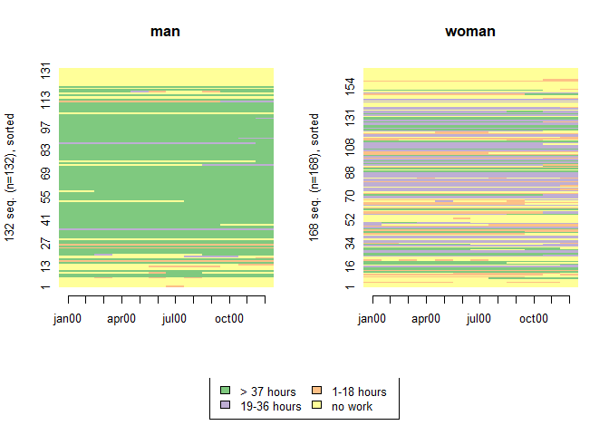
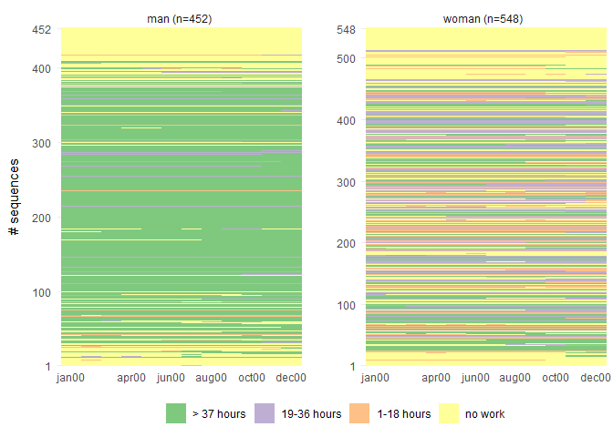
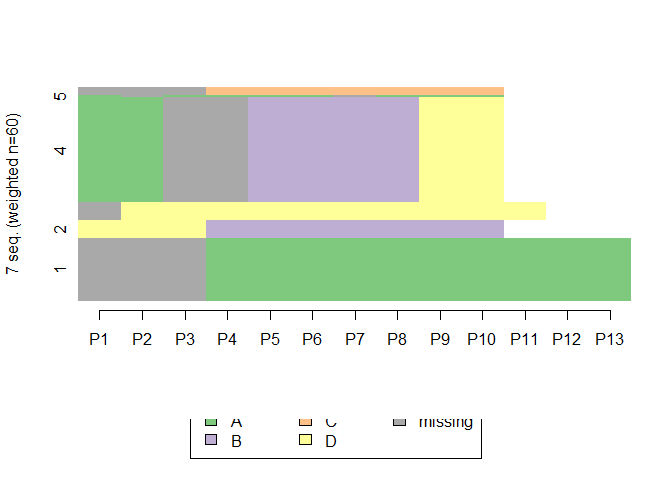
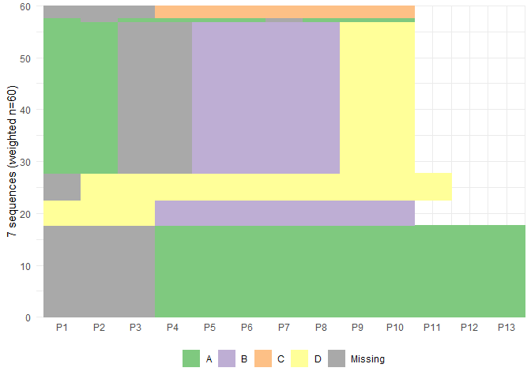
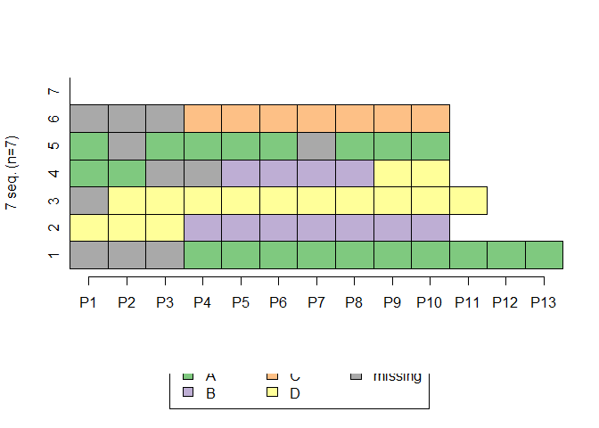
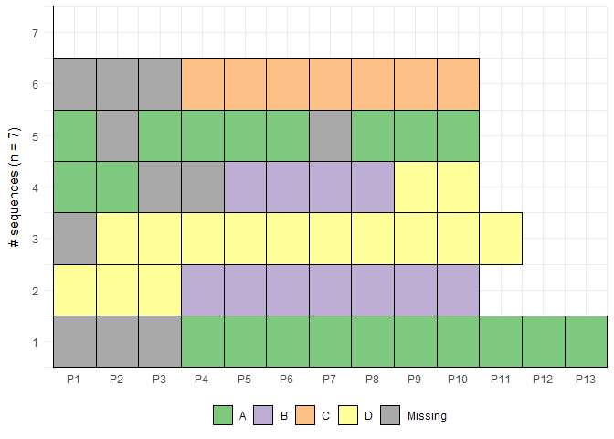
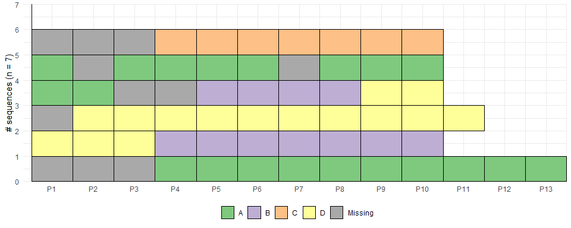
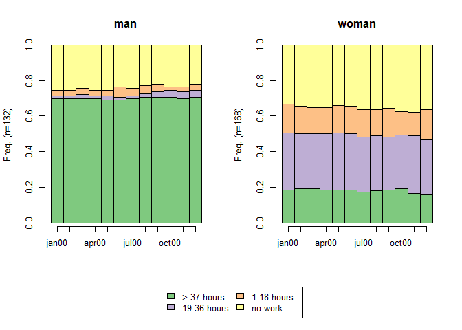
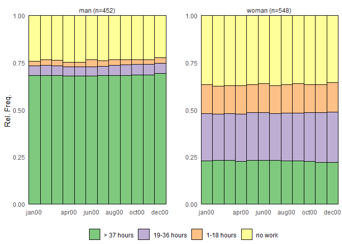
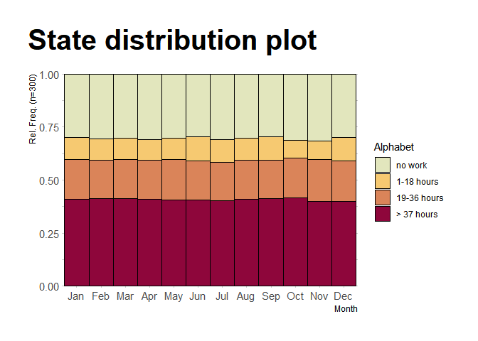

<!-- README.md is generated from README.Rmd. Please edit that file -->

# ggseqplot: ggplotify sequence data plots

<!-- badges: start -->


<!-- badges: end -->

The main goal of ggseqplot is to provide functions that reproduce some
of the sequence plots from `{TraMineR}`’s `seqplot` using `{ggplot2}`.
These plots are produced on the basis of a sequence object defined with
`TraMineR::seqdef`. The package automates the reshaping and plotting of
sequence data.

The development of this library of convenience functions is in an early
stage of development and will be hopefully complemented by a few
additional functions in the near future.

Currently, ggseqplot only contains two functions: - ggseqiplot (ggplot2
version of TraMineR::seqIplot) - ggseqdplot (ggplot2 version of
TraMineR::seqdplot)

## Installation

You can install this very early version of {ggseqplot} like so:

``` r
devtools::install_github("maraab23/ggseqplot")
```

## Setup for examples

We start by defining sequence objects with `TraMineR::seqdef` using the
code from the example section of its documentation. In the following
sections we use these sequence objects to render the “same” sequence
plots with `TraMineR::seqplot` and with the corresponding `{ggseqplot}`
functions using the same specification for plot width and height (7x5
inches).

``` r
library(TraMineR)
library(ggseqplot)

# Examples from TraMineR::seqplot
# actcal data set
data(actcal)

# We use only a sample of 300 cases
set.seed(1)
actcal <- actcal[sample(nrow(actcal),300),]
actcal.lab <- c("> 37 hours", "19-36 hours", "1-18 hours", "no work")
actcal.seq <- seqdef(actcal,13:24,labels=actcal.lab)

# ex1 using weights
data(ex1)
ex1.seq <- seqdef(ex1, 1:13, weights=ex1$weights)
```

## Sequence index plot

We start with a sequence plot of 2000 sequences grouped by sex. Grouping
in `{ggseqplot}`-functions is achieved via `ggplot2::facet_wrap`.

``` r
# with TraMineR::seqIplot
seqIplot(actcal.seq, group=actcal$sex,sortv=actcal$age00)
```



You’ll still need to render `README.Rmd` regularly, to keep `README.md`
up-to-date. `devtools::build_readme()` is handy for this. You could also
use GitHub Actions to re-render `README.Rmd` every time you push. An
example workflow can be found here:
<https://github.com/r-lib/actions/tree/v1/examples>.

You can also embed plots, for example:

``` r
# with ggseqplot::ggseqiplot
ggseqiplot(actcal.seq, group=actcal$sex, sortv=actcal$age00)
```

 Note
that we recommend to abstain from using regular sequence index plots
rendering more than 300-500 sequences because of the well-known issue of
overplotting. The code above just replicates an example of the `seqplot`
documentation. In real world applications we recommend to rather render
a subsample of sequences or to use relative frequency index plots.

  

The second example renders sequences of unequal length with missing
state, and weights. The default behavior of `ggseqplot` is identical to
`seqplot`:

1.  If weights have been specified when defining the sequence object
    with `seqdef`, they are automatically used.
2.  If sequences contain missing states they are automatically added to
    the alphabet and will also be plotted.

``` r
# with TraMineR::seqIplot
seqIplot(ex1.seq)
```



``` r
# with ggseqplot::ggseqiplot
ggseqiplot(ex1.seq)
```

 Of
course, it is possible to change the default behavior using the
well-known arguments of `{TraMineR}`’s `seqplot` function. In the
following example we ignore the weights and at add add borders around
each sequence position:

``` r
# with TraMineR::seqIplot
seqIplot(ex1.seq, weighted = FALSE, border = TRUE)
```



``` r
# with ggseqplot::ggseqiplot
ggseqiplot(ex1.seq, weighted = FALSE, border = TRUE)
```



If you haven’t notice the differences in the aspect ratio used by
`seqplot` and {ggseqplot} it earlier, you probably will have done so
now. Whereas the little boxes are displayed as rectangles in landscape
mode in `{TraMineR}`’s `seqIplot` they appear as rectangles in portrait
mode when using `ggseqiplot`. Within the world of `{ggplot2}` you have
multiple options to mimic the behavior of `seqplot`, for instance by
specifying height and width arguments when saving the figure with
`ggsave`:

``` r
ggsave("test.png", width = 10, height = 4)
```



## Sequence distribution plot

In that case, don’t forget to commit and push the resulting figure
files, so they display on GitHub and CRAN.

``` r
# with TraMineR::seqdplot
seqdplot(actcal.seq, group=actcal$sex)
```



``` r
# with ggseqplot::ggseqdplot
ggseqdplot(actcal.seq, group=actcal$sex)
```



## Using functionss of `{ggplot2}` and its friends to adjust figures

Rendering figures using `{ggplot2}` `{ggseqplot}` plots can be easily
manipulated with all the functions that are usually used to adjust the
`{ggplot2}` output. We also can utilize other libraries that were
designed to be used together `{ggplot2}`:

``` r
library(ggplot2)
library(ggthemes)
library(hrbrthemes)

ggseqdplot(actcal.seq) +
  colorspace::scale_fill_discrete_sequential("heat") +
  scale_x_discrete(labels = month.abb) +
  labs(title = "State distribution plot",
       x = "Month") +
  guides(fill=guide_legend(title="Alphabet")) +
  hrbrthemes::theme_ipsum_rc() +
  theme(plot.title = element_text(size = 30, 
                                  margin=margin(0,0,20,0)),
        plot.title.position = "plot")
```


