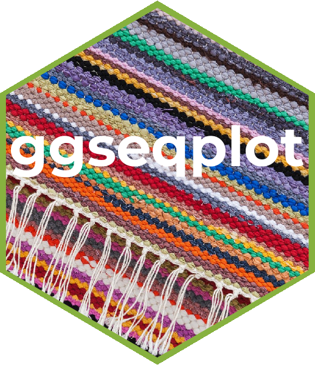

<!-- README.md is generated from README.Rmd. Please edit that file -->

# ggseqplot: ggplotify sequence data plots 

<!-- badges: start -->

[](https://cran.r-project.org/package=ggseqplot)
[](https://github.com/maraab23/ggseqplot/actions)
[](https://app.codecov.io/gh/maraab23/ggseqplot?branch=main)
<!-- badges: end -->

The main goal of [`{ggseqplot}`](https://maraab23.github.io/ggseqplot/)
is to provide functions that reproduce the sequence plots from
<a href="http://traminer.unige.ch"
target="_blank"><code>{TraMineR}</code></a>’s `seqplot` using
<a href="https://ggplot2.tidyverse.org/"
target="_blank"><code>{ggplot2}</code></a>. These plots are produced on
the basis of state sequence objects defined with `TraMineR::seqdef`. The
package automates the reshaping and plotting of sequence data.

Being a set of wrapper functions this library literally builds on the
excellent work of the <a href="http://traminer.unige.ch"
target="_blank"><code>{TraMineR}</code></a>,
<a href="http://traminer.unige.ch"
target="_blank"><code>{TraMineRExtras}</code></a>, and
<a href="https://ggplot2.tidyverse.org/"
target="_blank"><code>{ggplot2}</code></a> developers and uses several
of the their functions to produce ggplot2-flavored figures.

Note, that this library was not written because I personally dislike the
plots produced by <a href="http://traminer.unige.ch"
target="_blank"><code>{TraMineR}</code></a>, but rather because I am
normally using <a href="https://ggplot2.tidyverse.org/"
target="_blank"><code>{ggplot2}</code></a> instead of base R’s `plot`
environment for visualizing data. <a href="http://traminer.unige.ch"
target="_blank"><code>{TraMineR}</code></a> was developed before
<a href="https://ggplot2.tidyverse.org/"
target="_blank"><code>{ggplot2}</code></a> was as popular as it is today
and back then many users were more familiar with coding base R plots. To
date, however, many researchers and students are more accustomed to
using <a href="https://ggplot2.tidyverse.org/"
target="_blank"><code>{ggplot2}</code></a> and prefer to draw on the
related skills and experiences instead of learning how to refine base R
plots just for the single purpose of visualizing sequence data.

[`{ggseqplot}`](https://maraab23.github.io/ggseqplot/) contains the
following functions:

-   `ggseqdplot` (equivalent to `TraMineR::seqdplot`)
-   `ggseqeplot` (equivalent to `TraMineRextras::seqplot.tentrop`)
-   `ggseqmsplot` (equivalent to `TraMineR::seqmsplot`)
-   `ggseqmtplot` (equivalent to `TraMineR::seqmtplot`)
-   `ggstrqeplot` (based on transitions rates computed with
    `TraMineR::seqtrate`)
-   `ggseqiplot` (equivalent to `TraMineR::seqIplot`)
-   `ggseqfplot` (equivalent to `TraMineR::seqfplot`)
-   `ggseqrplot` (equivalent to `TraMineR::seqrplot`)
-   `ggseqrfplot` (equivalent to `TraMineRextras::seqplot.rf`)

If you have change requests or find errors, [create an
issue](https://github.com/maraab23/ggseqplot/issues/new) on github or
send me an
[email](mailto:marcel.raab@ifb.uni-bamberg.de?subject=ggseqplot%3A%20feature%20request).

A complementing
[vignette](https://maraab23.github.io/ggseqplot/articles/ggseqplot.html)
outlines how [`{ggseqplot}`](https://maraab23.github.io/ggseqplot/)
reshapes sequence data generated with <a href="http://traminer.unige.ch"
target="_blank"><code>{TraMineR}</code></a> functions to visualize them
using <a href="https://ggplot2.tidyverse.org/"
target="_blank"><code>{ggplot2}</code></a>. Moreover, it illustrates how
to adjust the baseline output using familiar
<a href="https://ggplot2.tidyverse.org/"
target="_blank"><code>{ggplot2}</code></a> functions (and add-ons).

## Installation

You can install the CRAN version of
[`{ggseqplot}`](https://maraab23.github.io/ggseqplot/) by typing:

``` r
install.packages("ggseqplot")
```

The development version can be installed with:

``` r
devtools::install_github("maraab23/ggseqplot")
```

## Acknowledgements

I want to thank like to thank Gilbert Ritschard, Tim Liao, and Emanuela
Struffolino for their comments on earlier versions of this library.
