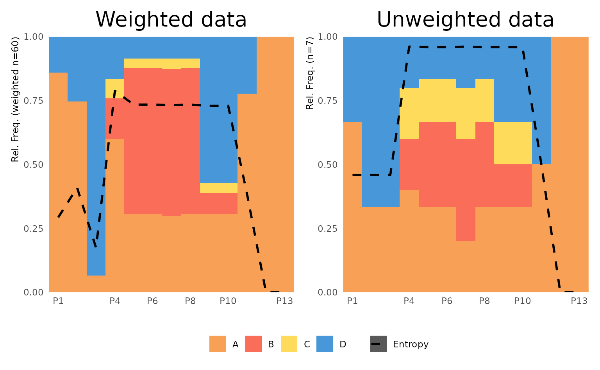
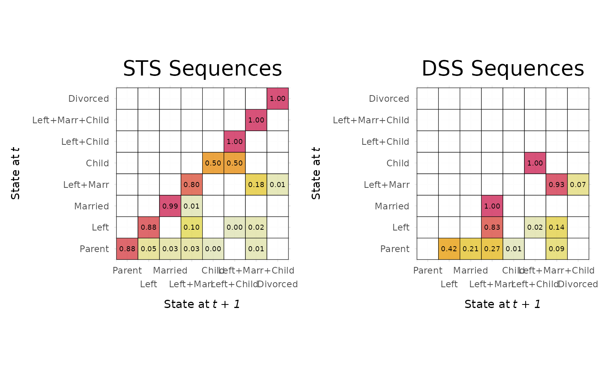
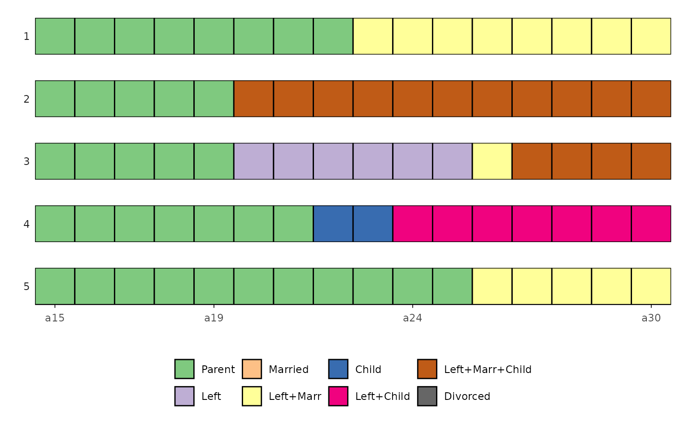
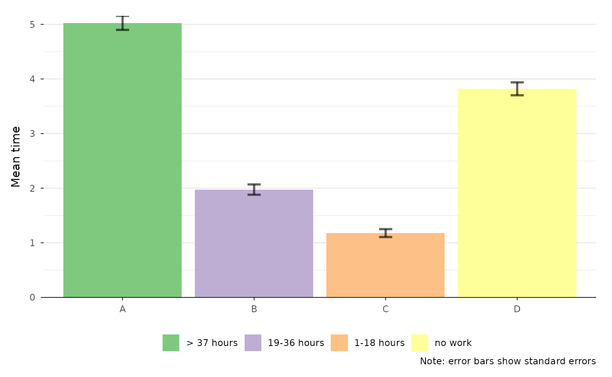
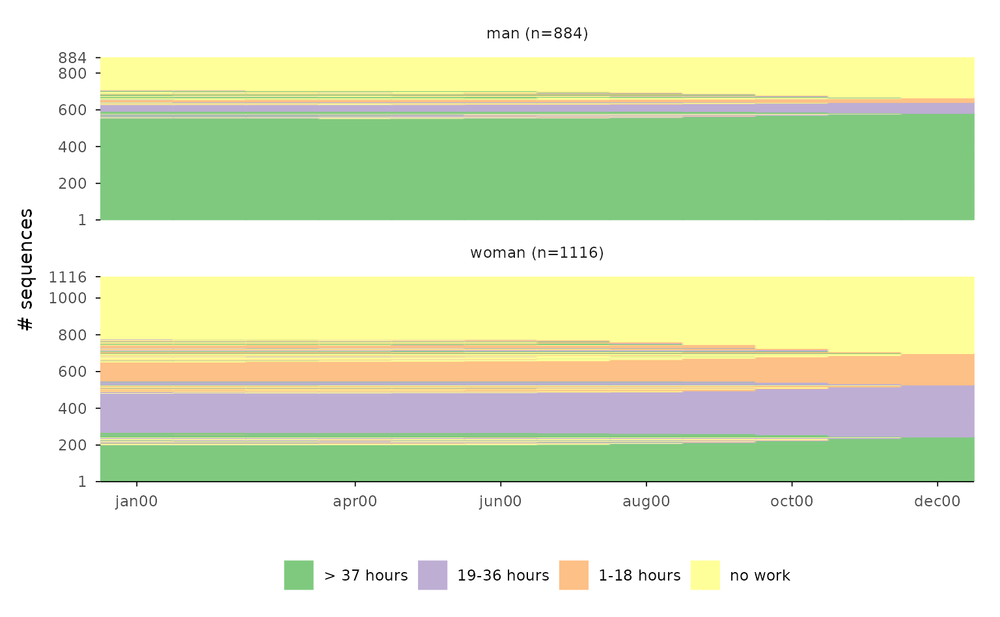
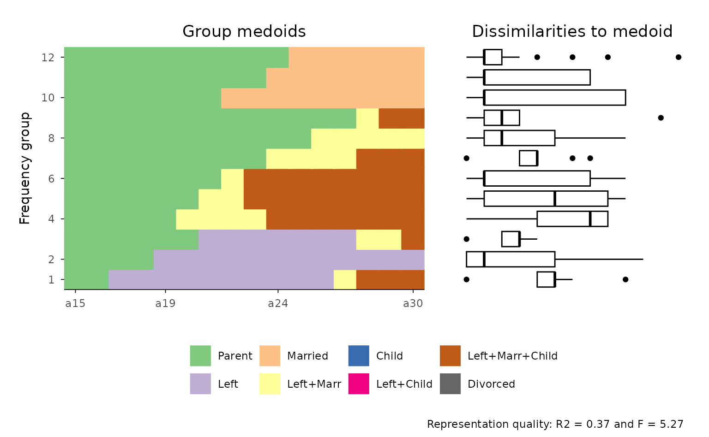
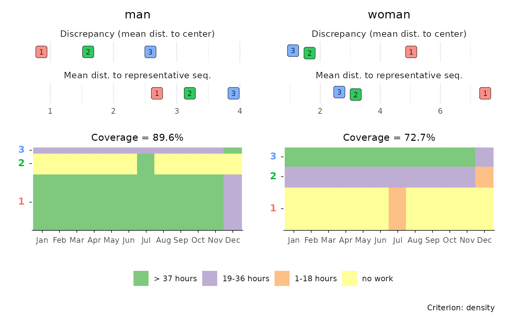
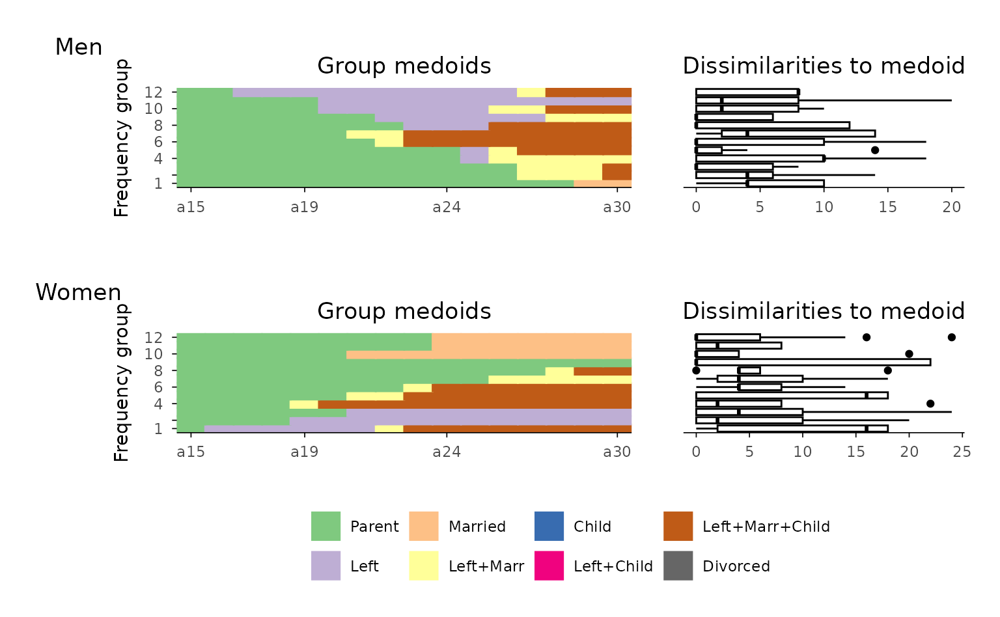

# Introduction to ggseqplot

## Prelude & Setup

Following Fasang and Liao (2014), we distinguish between **sequence
representation** and **summarization** graphs. Summarization plots
aggregate information from the data without displaying individual
sequences. Given the complexity of sequence data, these plots focus on
one or two dimensions of information stored in sequence data
(Brzinsky-Fay, 2014). Common examples include transition plots,
Kaplan-Meier curves, modal state plots, mean time plots, state
distribution plots, and entropy plots (Fasang & Liao, 2014; Raab &
Struffolino, 2022).

[`{ggseqplot}`](https://maraab23.github.io/ggseqplot/) includes five
types of summarization plots:

- State distribution plots (`ggseqdplot`)
- Entropy line plots (`ggseqplot`)
- Modal state sequence plot (`ggseqmsplot`)
- Mean time plot (`ggseqmtplot`)
- Transition rate plots (`ggseqtrplot`)

In contrast to summarization plots, representation plots visualize
actually observed sequences. The most basic version is the sequence
index plot, which displays all sequences in the dataset. However, this
approach becomes impractical with large datasets due to
overplotting—individual sequences may overlap, making the visualization
misleading. To address this, alternative representations that display
only a subset of sequences have been proposed.

[`{ggseqplot}`](https://maraab23.github.io/ggseqplot/) supports both
full and subset-based representation plots, offering the following plot
types:

- Sequence index plot (`ggseqiplot`)
- Sequence frequency plot (`ggseqfplot`)
- Representative sequence plot (`ggseqrplot`)
- Relative frequency sequence plot (`ggseqrfplot`)

For a deeper discussion of sequence data visualization, see Brzinsky-Fay
(2014), Fasang and Liao (2014) and Chapter 2 of Raab & Struffolino
(2022).

With the exception of transition rate plots, all of the plots listed
above can also be produced with
[`{TraMineR}`](http://traminer.unige.ch). In fact,
[`{TraMineR}`](http://traminer.unige.ch) typically offers more
customization options—but only through base R’s plotting system. If you
are comfortable using base R graphics, there may be little reason to
switch to [`{ggseqplot}`](https://maraab23.github.io/ggseqplot/).

However, [`{ggseqplot}`](https://maraab23.github.io/ggseqplot/) was
developed precisely because many R users today prefer
[`{ggplot2}`](https://ggplot2.tidyverse.org/) to base R’s `plot`
environment for visualizing data.
[`{TraMineR}`](http://traminer.unige.ch) (Gabadinho et al., 2011) was
developed before [`{ggplot2}`](https://ggplot2.tidyverse.org/) (Wickham,
2016) was as popular as it is today and back then many users were more
familiar with coding base R plots. Today, most researchers and students
are more familiar with [`{ggplot2}`](https://ggplot2.tidyverse.org/) and
would rather build on existing skills instead of learning how to refine
base R plots just for sequence visualizations.

This vignette demonstrates how sequence objects created via
[`TraMineR::seqdef`](https://rdrr.io/pkg/TraMineR/man/seqdef.html) are
reshaped to plot them as ggplot2-typed figures using
[`{ggseqplot}`](https://maraab23.github.io/ggseqplot/).

It outlines which functions from
[`{TraMineR}`](http://traminer.unige.ch) and the
[`{ggplot2}`](https://ggplot2.tidyverse.org/) universe are involved in
generating the visualizations.

The vignette further illustrates how the appearance of plots produced
with [`{ggseqplot}`](https://maraab23.github.io/ggseqplot/) can be
customized using [`{ggplot2}`](https://ggplot2.tidyverse.org/) functions
and extensions.

#### Setup example

We begin by loading the required libraries and preparing the sequence
data to be visualized. The examples are based on data sets and examples
provided by the [`{TraMineR}`](http://traminer.unige.ch) package.

  

**Click to show code for installing and loading required packages**

``` r
## ~~~~~~~~~~~~~~~~~~~~~~~~~~~~~~~~~~~~~~~~~~~~~~~~~~~~~~~
## Load and download (if necessary) required packages ----
## ~~~~~~~~~~~~~~~~~~~~~~~~~~~~~~~~~~~~~~~~~~~~~~~~~~~~~~~


## Save package names as a vector of strings
pkgs <- c("colorspace", # for using colors palettes
          "forcats", # for dropping unused factor levels with `fct_drop`
          "ggh4x", # for proportional panel sized with `force_panelsizes`
          "ggplot2", # for using all the ggplot2 functions 
          "ggthemes", # for getting access to the canva_palettes
          "patchwork", # for working with plot types built with patchwork
          "purrr", # used in the grouped rplot example
          "TraMineR") # the ultimate sequence analysis suite


## Install uninstalled packages
lapply(pkgs[!(pkgs %in% installed.packages())], 
       install.packages, repos = getOption("repos")["CRAN"])


## Load all packages to library and adjust options
lapply(pkgs, library, character.only = TRUE)

## Don't forget to load ggseqplot
library(ggseqplot)
```

``` r


## ~~~~~~~~~~~~~~~~~~~~~~~~~~~~~~~~~~~~~~~~~~~~~~~~~~~~~~~~~~~
## Creating state sequence objects from example data sets ----
## ~~~~~~~~~~~~~~~~~~~~~~~~~~~~~~~~~~~~~~~~~~~~~~~~~~~~~~~~~~~

## biofam data
data(biofam)

biofam.lab <- c("Parent", "Left", "Married", "Left+Marr",
                "Child", "Left+Child", "Left+Marr+Child", "Divorced")

biofam.seq <- seqdef(biofam[501:600, ], 10:25, # we only use a subsample
                     labels = biofam.lab,
                     weights = biofam$wp00tbgs[501:600])

## actcal data
data(actcal)

actcal.lab <- c("> 37 hours", "19-36 hours", "1-18 hours", "no work")

actcal.seq <- seqdef(actcal,13:24,
                     labels=actcal.lab)

## ex1 data
data(ex1)
ex1.seq <- seqdef(ex1, 1:13, 
                  weights=ex1$weights)
```

**Note:** The default figure size in this document is
`fig.width=8, fig.height=4.94`  
  
  

## Technicalities

All functions in [`{ggseqplot}`](https://maraab23.github.io/ggseqplot/)
follow a similar structure: they take a state sequence object—created
with
[`TraMineR::seqdef`](https://rdrr.io/pkg/TraMineR/man/seqdef.html)—as
their starting point. The functions either operate directly on the
sequence data or use other [`{TraMineR}`](http://traminer.unige.ch)
functions, such as
[`TraMineR::seqstatd`](https://rdrr.io/pkg/TraMineR/man/seqstatd.html),
to derive the information to be visualized.

Internally, [`{ggseqplot}`](https://maraab23.github.io/ggseqplot/)
reshapes the data into a tidy (long) format before plotting them with
[`{ggplot2}`](https://ggplot2.tidyverse.org/) functions. This reshaping
step is typically necessary for creating layered and faceted graphics in
the grammar of graphics framework.

The following example demonstrates this process using a state
distribution plot. First, we compute the cross-sectional state
distributions across the sequence positions:

``` r
seqstatd(actcal.seq)
#>   [State frequencies]
#>   jan00 feb00 mar00 apr00 may00 jun00 jul00 aug00 sep00 oct00 nov00 dec00
#> A 0.421 0.420 0.421 0.417 0.419  0.42  0.42  0.42  0.42 0.418 0.414 0.415
#> B 0.162 0.162 0.162 0.162 0.162  0.16  0.16  0.17  0.17 0.169 0.170 0.171
#> C 0.098 0.098 0.098 0.097 0.097  0.10  0.10  0.10  0.10 0.096 0.096 0.098
#> D 0.320 0.321 0.320 0.324 0.322  0.32  0.32  0.31  0.31 0.318 0.320 0.317
#> 
#>    [Valid states]
#>   jan00 feb00 mar00 apr00 may00 jun00 jul00 aug00 sep00 oct00 nov00 dec00
#> N  2000  2000  2000  2000  2000  2000  2000  2000  2000  2000  2000  2000
#> 
#>    [Entropy index]
#>   jan00 feb00 mar00 apr00 may00 jun00 jul00 aug00 sep00 oct00 nov00 dec00
#> H   0.9   0.9   0.9   0.9   0.9   0.9   0.9  0.91  0.91   0.9  0.91  0.91
```

When calling `ggseqdplot`, these distributional data are internally
reshaped into a long-format dataset, where each row represents the
(weighted) relative frequency of a specific state at a specific sequence
position.

For example, the `actcal.seq` data contain sequences of length 12 with
an alphabet of 4 states. The reshaped dataset used for plotting will
therefore consist of $12 \times 4 = 48$ rows. If a grouping variable is
provided, the resulting dataset will contain 48 rows per group. To
inspect this internal data structure, assign the plot output to an
object. The resulting list object stores the data as its first element
(named `data`).

``` r
dplot <- ggseqdplot(actcal.seq)
dplot$data
#> # A tibble: 48 × 6
#>    group state      k     x     value grouplab           
#>    <fct> <fct>      <fct> <fct> <dbl> <fct>              
#>  1 1     > 37 hours jan00 1     0.421 Rel. Freq. (n=2000)
#>  2 1     > 37 hours feb00 2     0.420 Rel. Freq. (n=2000)
#>  3 1     > 37 hours mar00 3     0.422 Rel. Freq. (n=2000)
#>  4 1     > 37 hours apr00 4     0.418 Rel. Freq. (n=2000)
#>  5 1     > 37 hours may00 5     0.420 Rel. Freq. (n=2000)
#>  6 1     > 37 hours jun00 6     0.42  Rel. Freq. (n=2000)
#>  7 1     > 37 hours jul00 7     0.422 Rel. Freq. (n=2000)
#>  8 1     > 37 hours aug00 8     0.420 Rel. Freq. (n=2000)
#>  9 1     > 37 hours sep00 9     0.418 Rel. Freq. (n=2000)
#> 10 1     > 37 hours oct00 10    0.418 Rel. Freq. (n=2000)
#> # ℹ 38 more rows
```

Once the data are in the correct shape,
[`{ggseqplot}`](https://maraab23.github.io/ggseqplot/) uses standard
[`{ggplot2}`](https://ggplot2.tidyverse.org/) functions to create the
visualizations. In the case of state distribution plots, for instance,
`ggseqdplot` renders stacked bar charts for each sequence position using
[`ggplot2::geom_bar`](https://ggplot2.tidyverse.org/reference/geom_bar.html).

The following table summarizes the core internal function calls for the
various plot types available in
[`{ggseqplot}`](https://maraab23.github.io/ggseqplot/):

[TABLE]

Most plots created with
[`{ggseqplot}`](https://maraab23.github.io/ggseqplot/) behave like
regular ggplots. You can customize them by adding themes, adjusting
scales, or using other standard
[`{ggplot2}`](https://ggplot2.tidyverse.org/) syntax via `+`.

Representative sequence plots and relative frequency sequence plots,
however, behave differently because they are composed of multiple
subplots which are arranged using the
[`{patchwork}`](https://patchwork.data-imaginist.com/index.html)
library. The following section illustrates how the appearance of the
plots can be changed.  
  
  

## Changing the appearance of plots

### The default case

As mentioned above, most plots rendered by
[`{ggseqplot}`](https://maraab23.github.io/ggseqplot/) are of class
`c("gg", "ggplot")` and can be customized just like any other plot
created with [`{ggplot2}`](https://ggplot2.tidyverse.org/)

#### Example 1: State distribution plot

We begin with a simple state distribution plot using the sequence object
`actcal.seq`, without modifying the default settings.

``` r
ggseqdplot(actcal.seq)
```


Next, we demonstrate how to refine the plot using a variety of
[`{ggplot2}`](https://ggplot2.tidyverse.org/) functions and extensions.
As with any other [`{ggplot2}`](https://ggplot2.tidyverse.org/) plot,
the appearance of plots generated with
[`{ggseqplot}`](https://maraab23.github.io/ggseqplot/) functions can be
extensively customized:

``` r
ggseqdplot(actcal.seq) +
  scale_fill_discrete_sequential("heat") +
  scale_x_discrete(labels = month.abb) +
  labs(title = "State distribution plot",
       x = "Month") +
  guides(fill=guide_legend(title="Alphabet")) +
  theme_minimal(base_family = "") +
  theme(plot.title = element_text(size = 30, margin=margin(0,0,20,0)),
        plot.title.position = "plot",
        axis.title.x = element_text(hjust = 1, 
                                    vjust = -1),
        axis.title.y = element_text(hjust = 1, 
                                    vjust = 1),
        axis.title = element_text(size = 9))
```


In the following example, we use two `ggseqdplot` calls to create plots
of the same data, one with and one without weights. We also display
entropy lines (`geom_line`) and combine the two plots using the
[`{patchwork}`](https://patchwork.data-imaginist.com/index.html) package
(Pedersen, 2020).

``` r
# Save plot using weights
p1 <- ggseqdplot(ex1.seq, 
                 with.entropy = TRUE) + 
  ggtitle("Weighted data")

# Save same plot without using weights
p2 <- ggseqdplot(ex1.seq, 
                 with.entropy = TRUE,
                 weighted = FALSE) + 
  ggtitle("Unweighted data")

# Arrange and refine plots using patchwork
p1 + p2 + 
  plot_layout(guides = "collect") &
  scale_fill_manual(values= canva_palettes$`Fun and tropical`[1:4]) &
  theme_minimal(base_family = "") &
  theme(plot.title = element_text(size = 20,
                                  hjust = 0.5),
        legend.position = "bottom",
        legend.title = element_blank(),
        axis.title.x = element_text(hjust = 1, 
                                    vjust = -1),
        axis.title.y = element_text(hjust = 1, 
                                    vjust = 1),
        axis.title = element_text(size = 9))
```



#### Example 2: Transition rate plot

In the next set of examples, we refine plots generated by `ggseqtrplot`,
which internally calls
[`TraMineR::seqtrate`](https://rdrr.io/pkg/TraMineR/man/seqtrate.html)
to compute the transition rates between states. These rates are returned
in a symmetrical matrix and then reshaped into long format within
`ggseqtrplot` to be plotted with
[`ggplot2::geom_tile`](https://ggplot2.tidyverse.org/reference/geom_tile.html).

We begin with a basic example that visualizes transition rate matrices
for two groups defined by the sex variable The output is a faceted plot
visualizing two transition rate matrices of DSS sequence data.

``` r
ggseqtrplot(actcal.seq, 
            group = actcal$sex)
#>  [>] computing transition probabilities for states A/B/C/D ...
#>  [>] computing transition probabilities for states A/B/C/D ...
```


In the second example, we add customizations and utilize once again the
[`{patchwork}`](https://patchwork.data-imaginist.com/index.html) library
to compose a figure that compares the transition matrices of the same
sequence data in STS and DSS format.

We set `x_n.dodge = 2` to prevent overlapping x-axis labels, reduce the
font size of the value labels displayed within the tiles
(`labsize = 7`), and set `dss = FALSE` to switch to the STS format.

``` r

p1 <- ggseqtrplot(biofam.seq, 
                  dss = FALSE, 
                  x_n.dodge = 2,
                  labsize = 7) +
  ggtitle("STS Sequences") +
  theme(plot.margin = unit(c(5,10,5,5), "points"))
#>  [>] computing transition probabilities for states 0/1/2/3/4/5/6/7 ...

p2 <- ggseqtrplot(biofam.seq, 
                  x_n.dodge = 2,
                  labsize = 7) +
    ggtitle("DSS Sequences") +
  theme(plot.margin = unit(c(5,5,5,10), "points"))
#>  [>] computing transition probabilities for states 0/1/2/3/4/5/6/7 ...

p1 + p2 &
  theme(plot.title = element_text(size = 20,
                                  hjust = 0.5))
```



In contrast to the grouped plot above, the combined figure contains
duplicated y-axis labels and titles. These can be removed using standard
[`ggplot2::theme()`](https://ggplot2.tidyverse.org/reference/theme.html)
arguments:

``` r

p2 <- p2 +
  theme(axis.text.y = element_blank(), 
        axis.title.y = element_blank())

p1 + p2 &
  theme(plot.title = element_text(size = 20,
                                  hjust = 0.5))
```


#### Example 3: Sequence index plots of illustrative (very few) sequences

[`{TraMineR}`](http://traminer.unige.ch) offers two types of sequence
index plots:
[`TraMineR::seqiplot`](https://rdrr.io/pkg/TraMineR/man/seqplot.html)
for displaying a small selection of sequences (typically no more than
10), and
[`TraMineR::seqIplot`](https://rdrr.io/pkg/TraMineR/man/seqplot.html)
for plotting the full set of sequences. The former adds white space
between the displayed sequences, making it well suited for illustrative
purposes—for example, when showcasing a few hand-picked sequences in
publications or teaching materials. While
[`{ggseqplot}`](https://maraab23.github.io/ggseqplot/) does not provide
built-in spacing between sequences, a similar effect can be achieved
with a small trick: by assigning each sequence to its own group via the
group argument, `ggseqiplot` uses
[`ggplot2::facet_wrap`](https://ggplot2.tidyverse.org/reference/facet_wrap.html)
to place each sequence in a separate panel, thereby visually separating
them.

In the example below, we display five sequences (`biofam.seq[2:6,]`) as
a faceted plot, where each sequence forms its own group (`group = 1:5`)
and is shown in a separate panel arranged in a single column
(`facet_ncol = 1`). The remainder of the code applies visual
fine-tuning: group labels are moved to the left
(`strip.position = "left"`) and rotated
(`strip.text.y.left = element_text(angle = 0)`); superfluous axis
elements—such as y-axis labels (`axis.text.y = element_blank()`), ticks
(`axis.ticks.y = element_blank()`), and the axis title
(`labs(y = NULL)`)—are removed; and the white space between sequences is
slightly reduced by adjusting vertical panel spacing
(`panel.spacing.y = unit(1.5, "lines")`).

``` r
# plot a subset of 5 sequences from biofam.seq
ggseqiplot(biofam.seq[2:6,],
           group = 1:5,
           facet_ncol = 1,
           strip.position = "left",
           no.n = TRUE,
           border = TRUE, 
           weighted = FALSE) +
  labs(y = NULL) +
  theme(strip.text.y.left = element_text(angle = 0),
        panel.spacing.y = unit(1.5, "lines"),
        axis.text.y =  element_blank(),
        axis.ticks.y = element_blank())
```



#### Example 4: Flipping coordinates

Another way to adjust the appearance of plots rendered by
[`{ggseqplot}`](https://maraab23.github.io/ggseqplot/) is to flip their
coordinates—an approach commonly used in the
[`{ggplot2}`](https://ggplot2.tidyverse.org/) ecosystem.

In the example below, we illustrate coordinate flipping for both a mean
time plot and a sequence index plot. For each plot type, we show the
default version followed by its flipped counterpart:

``` r
## default plot
ggseqmtplot(actcal.seq, no.n = TRUE, error.bar = "SE") 
```



``` r

## flipped version
ggseqmtplot(actcal.seq, no.n = TRUE, error.bar = "SE") +
 coord_flip() +
 theme(axis.text.y=element_blank(),
       axis.ticks.y = element_blank(),
       panel.grid.major.y = element_blank(),
       legend.position = "top")
```


While the flipped version above may be more in line with some users’
aesthetic preferences, flipping coordinates for sequence index plots is
a more opinionated design choice. Most researchers display time along
the horizontal axis. However, if you prefer time to *run*
vertically—bottom to top, as in Piccarreta and Lior (Piccarreta & Lior,
2010)—this preference is easily accommodated:

``` r
## default plot
ggseqiplot(actcal.seq, sortv = "from.end") + 
  scale_x_discrete(labels = month.abb) 
#> Scale for x is already present.
#> Adding another scale for x, which will replace the existing scale.
```


``` r

## flipped version
ggseqiplot(actcal.seq, sortv = "from.end") + 
  scale_x_discrete(labels = month.abb) +
  coord_flip()
#> Scale for x is already present.
#> Adding another scale for x, which will replace the existing scale.
```


#### Example 5: Proportional panel sizes for grouped sequence plots

A common use case—especially in the context of cluster analyses—is to
display grouped sequence plots with panel sizes that reflect the
relative size of each group. This makes the visualization more
informative, as it visually communicates the prevalence of each group.

In the following example, we illustrate this approach using `actcal$sex`
as the grouping variable. As before, the `group` argument is used to
split the data into separate panels arranged in a single column
(`facet_ncol = 1`). To scale the height of each panel proportionally to
the group size, we compute the relative frequencies using:

``` r
hghts <- table(fct_drop(actcal$sex)) / nrow(actcal.seq)
```

The `fct_drop()` function ensures that only those factor levels actually
present in the data are considered when tabulating group sizes—this
avoids reserving space for empty panels corresponding to unused levels.
We then pass the resulting proportions to
[`ggh4x::force_panelsizes()`](https://teunbrand.github.io/ggh4x/reference/force_panelsizes.html)
via the `rows` argument. This function adjusts the panel heights
accordingly, so that larger groups occupy more vertical space in the
plot. Finally, we reduce the spacing between panels using
`theme(panel.spacing = unit(1, "lines"))` for a more compact appearance.

``` r
## use ggh4x::force_panelsizes to get proportional panels
ggseqiplot(actcal.seq, 
           sortv = "from.end", 
           group = actcal$sex,
           facet_ncol = 1) +
  force_panelsizes(rows = hghts) +
  theme(panel.spacing = unit(1, "lines"))
```



### The special case of combined plots

Two types of plots differ from the standard behavior of
[`{ggseqplot}`](https://maraab23.github.io/ggseqplot/) functions: they
are composed by two subplots, which are arranged into a single figure
using the
[`{patchwork}`](https://patchwork.data-imaginist.com/index.html)
library. Because of this composition, their appearance cannot be
adjusted in exactly the same way as plots returned directly as `ggplot`
objects. For more details on the functionality and syntax of
[`{patchwork}`](https://patchwork.data-imaginist.com/index.html),  
we refer readers to the to the package documentation.

#### Example 6: Annotation and themes

Despite their special structure, many aspects of combined
[`{patchwork}`](https://patchwork.data-imaginist.com/index.html) plots
can still be customized in ways familiar from
[`{ggplot2}`](https://ggplot2.tidyverse.org/). For example, themes and
plot annotations can be modified using the `&` operator (instead of `+`,
which is used for standard `ggplot` objects).

``` r
## compute dissimilarity matrix required for plot
diss <- seqdist(biofam.seq, method = "LCS")
#>  [>] 100 sequences with 8 distinct states
#>  [>] creating a 'sm' with a substitution cost of 2
#>  [>] creating 8x8 substitution-cost matrix using 2 as constant value
#>  [>] 76 distinct  sequences
#>  [>] min/max sequence lengths: 16/16
#>  [>] computing distances using the LCS metric
#>  [>] elapsed time: 0.018 secs

## Relative Frequency Sequence Plot
## default version
ggseqrfplot(biofam.seq, diss = diss, k = 12) 
#>  [>] Using k=12 frequency groups with grp.meth='prop'
#>  [>] Pseudo/medoid-based-R2: 0.367766
#>  [>] Pseudo/medoid-based-F statistic: 5.268049, p-value: 1.655783e-06
```


``` r

## adjusted version
ggseqrfplot(biofam.seq, diss = diss, k = 12) &
  theme_minimal(base_family = "") &
  theme(legend.position = "bottom",
        legend.title = element_blank(),
        plot.title = element_text(size = 12),
        axis.title.x = element_text(hjust = 1, 
                                    vjust = -1),
        axis.title.y = element_text(hjust = 1, 
                                    vjust = 1),
        axis.title = element_text(size = 9)) &
  plot_annotation(title = "Relative Frequency Sequence Plot")
#>  [>] Using k=12 frequency groups with grp.meth='prop'
#>  [>] Pseudo/medoid-based-R2: 0.367766
#>  [>] Pseudo/medoid-based-F statistic: 5.268049, p-value: 1.655783e-06
```


If you want to manipulate the appearance of a specific subplot, however,
the default approach might not work as expected. For example, if you aim
to change the x-axis labels of the index plot, the following code will
*not* yield the intended result:

``` r
ggseqrfplot(biofam.seq, diss = diss, k = 12) +
  scale_x_discrete(labels = 15:30)
#>  [>] Using k=12 frequency groups with grp.meth='prop'
#>  [>] Pseudo/medoid-based-R2: 0.367766
#>  [>] Pseudo/medoid-based-F statistic: 5.268049, p-value: 1.655783e-06
```



In this case,
[`scale_x_discrete()`](https://ggplot2.tidyverse.org/reference/scale_discrete.html)
will be applied to the boxplot (i.e., the last plot constructed in the
combined object), not to the index plot. This behavior arises because
the `+` operator affects the final `ggplot` object passed into the
patchwork layout.

To adjust the appearance of individual subplots within a combined plot,
you need to first save the composite plot object, access its components,
and then modify them individually before reassembling the full plot.

``` r
## save & view original plot
p <- ggseqrfplot(biofam.seq, diss = diss, k = 12)
#>  [>] Using k=12 frequency groups with grp.meth='prop'
#>  [>] Pseudo/medoid-based-R2: 0.367766
#>  [>] Pseudo/medoid-based-F statistic: 5.268049, p-value: 1.655783e-06
p
```


``` r

## change appearance of sub-plots

## first component: index plot
p[[1]] <- p[[1]] +
  scale_x_discrete(labels = 15:30)
#> Scale for x is already present.
#> Adding another scale for x, which will replace the existing scale.

## second component: boxplot
p[[2]] <- p[[2]] + labs(title = "Changed title")

## adjusted plot
p
```


#### Example 7: The complex case of grouped rplots

Things become a bit more complex when working with grouped
representative sequence plots. In such plots, each group contributes two
subplots: one showing information on the “quality” of the representative
sequences (e.g., frequency, coverage, or centrality), and another
displaying the corresponding index plots.

If you want to adjust the x-axis labels, for example, you must
specifically target the index plots, which appear in the second row of
the combined layout. The subplots are arranged by row, so for a
two-group example, the index plots correspond to subplots 3 and 4.

To apply the desired changes, you need to extract these components,
modify them as needed, and then re-plot the final figure.

``` r
## Compute a pairwise dissimilarity matrix
diss <- seqdist(actcal.seq, method = "LCS")
#>  [>] 2000 sequences with 4 distinct states
#>  [>] creating a 'sm' with a substitution cost of 2
#>  [>] creating 4x4 substitution-cost matrix using 2 as constant value
#>  [>] 186 distinct  sequences
#>  [>] min/max sequence lengths: 12/12
#>  [>] computing distances using the LCS metric
#>  [>] elapsed time: 0.267 secs

## original plot
p <- ggseqrplot(actcal.seq, 
                diss = diss,
                nrep = 3,
                group = actcal$sex)
#>  [>] number of objects (sum of weights): 884
#>  [>] max. distance: 24
#>  [>] neighborhood radius: 2.4
#>  [>] 3 representative(s) selected
#>  [>] 80 distinct sequence(s)
#>  [>] number of objects (sum of weights): 1116
#>  [>] max. distance: 24
#>  [>] neighborhood radius: 2.4
#>  [>] 3 representative(s) selected
#>  [>] 144 distinct sequence(s)
p
```


``` r

## adjusted sequence index subplots
p[[3]] <- p[[3]] +
  scale_x_discrete(labels = month.abb) 
#> Scale for x is already present.
#> Adding another scale for x, which will replace the existing scale.

p[[4]] <- p[[4]] +
  scale_x_discrete(labels = month.abb) 
#> Scale for x is already present.
#> Adding another scale for x, which will replace the existing scale.

p
```



#### Example 8: What about grouped rfplots?

Grouped representative frequency plots are currently **not implemented**
in `ggseqrfplot` and must be assembled *manually* using the
[`{patchwork}`](https://patchwork.data-imaginist.com/index.html)
library.

In the following example, we:

1.  Create rfplots for each group (here: “Men” and “Women”),  
2.  Slightly *misuse*
    [`{patchwork}`](https://patchwork.data-imaginist.com/index.html)’s
    tag annotation to assign group-specific labels to the first plot in
    each row,
3.  Remove the legend from the upper plot panel (`p$man`), and
4.  Combine the two plots in a final stacked figure using a nested
    patchwork layout.

Technically, the resulting plot is a nested patchwork plot. According to
the [`{patchwork}`](https://patchwork.data-imaginist.com/index.html)
documentation,

> \[i\]t is important to note that plot annotations only have an effect
> on the top-level patchwork. Any annotation added to nested patchworks
> are (currently) lost. If you need to have annotations for a nested
> patchwork you’ll need to wrap it in wrap_elements() with the
> side-effect that alignment no longer works.[¹](#fn1)

For this reason, we refrained from using
[`patchwork::plot_annotation`](https://patchwork.data-imaginist.com/reference/plot_annotation.html)
or
[`ggplot2::ggtitle`](https://ggplot2.tidyverse.org/reference/labs.html)
to add group titles and used plot tags instead.

``` r

diss <- seqdist(biofam.seq, method = "LCS")
#>  [>] 100 sequences with 8 distinct states
#>  [>] creating a 'sm' with a substitution cost of 2
#>  [>] creating 8x8 substitution-cost matrix using 2 as constant value
#>  [>] 76 distinct  sequences
#>  [>] min/max sequence lengths: 16/16
#>  [>] computing distances using the LCS metric
#>  [>] elapsed time: 0.017 secs

sex <- biofam[501:600, "sex"]

p <- map2(
  levels(sex), # input x
  c("Men", "Women"), # input y
  function(x, y) {
    p <- ggseqrfplot(biofam.seq[sex == x,],
                     diss = diss[sex == x,sex == x],
                     k = 12)
    p[[1]] <- p[[1]] + labs(tag = y)
    return(p)
    }
  )
#>  [>] Using k=12 frequency groups with grp.meth='prop'
#>  [>] Pseudo/medoid-based-R2: 0.5448432
#>  [>] Pseudo/medoid-based-F statistic: 3.408139, p-value: 0.003407164
#>  [>] Using k=12 frequency groups with grp.meth='prop'
#>  [>] Pseudo/medoid-based-R2: 0.5263291
#>  [>] Pseudo/medoid-based-F statistic: 5.687386, p-value: 4.537004e-06

names(p) <- levels(sex)

(p$man & theme(legend.position = "none")) / p$woman
```



This approach gives you full control over the layout and design of
grouped rfplots, even in the absence of direct support in the
`ggseqrfplot` function.

------------------------------------------------------------------------

## References

Brzinsky-Fay, C. (2014). *Graphical Representation of Transitions and
Sequences* (P. Blanchard, F. Bühlmann, & J.-A. Gauthier, Eds.; pp.
265–284). Springer. <https://doi.org/10.1007/978-3-319-04969-4_14>

Fasang, A. E., & Liao, T. F. (2014). Visualizing Sequences in the Social
Sciences: Relative Frequency Sequence Plots. *Sociological Methods &
Research*, *43*(4), 643–676. <https://doi.org/10.1177/0049124113506563>

Gabadinho, A., Ritschard, G., Müller, N. S., & Studer, M. (2011).
Analyzing and Visualizing State Sequences in R with TraMineR. *Journal
of Statistical Software*, *40*(4), 1–37.
<https://doi.org/10.18637/jss.v040.i04>

Pedersen, T. L. (2020). *Patchwork: The composer of plots*.
<https://CRAN.R-project.org/package=patchwork>

Piccarreta, R., & Lior, O. (2010). Exploring sequences: A graphical tool
based on multi-dimensional scaling: Exploring Sequences. *Journal of the
Royal Statistical Society: Series A (Statistics in Society)*, *173*(1),
165–184. <https://doi.org/10.1111/j.1467-985X.2009.00606.x>

Raab, M., & Struffolino, E. (2022). *Sequence analysis* (Vol. 190).
SAGE. <https://sa-book.github.io/>

Wickham, H. (2016). *ggplot2: Elegant graphics for data analysis* (2nd
ed. 2016). Springer. <https://doi.org/10.1007/978-3-319-24277-4>

------------------------------------------------------------------------

1.  <https://patchwork.data-imaginist.com/articles/guides/annotation.html#titles-subtitles-and-captions>
